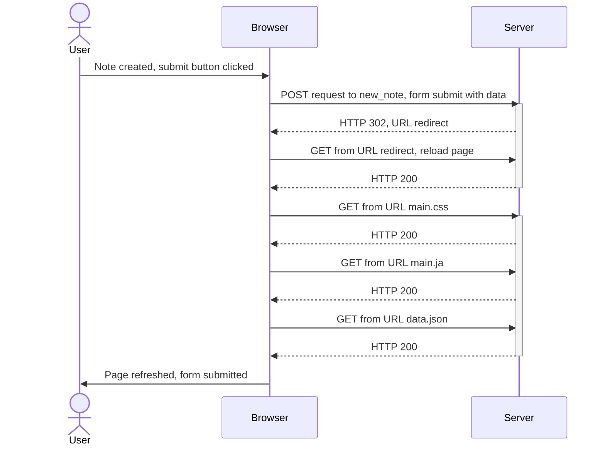

```mermaid

sequenceDiagram
actor User
participant Browser
participant Server

User->>Browser: Note created, submit button clicked
Browser->>Server: POST request to new_note, form submit with data
activate Server
Server-->>Browser: HTTP 302, URL redirect
Browser->>Server: GET from URL redirect, reload page
Server-->>Browser: HTTP 200
deactivate Server

Browser->>Server: GET from URL main.css
activate Server
Server-->>Browser: HTTP 200
Browser->>Server: GET from URL main.ja
Server-->>Browser: HTTP 200
Browser->>Server: GET from URL data.json
Server-->>Browser: HTTP 200
deactivate Server

Browser->>User: Page refreshed, form submitted
```
