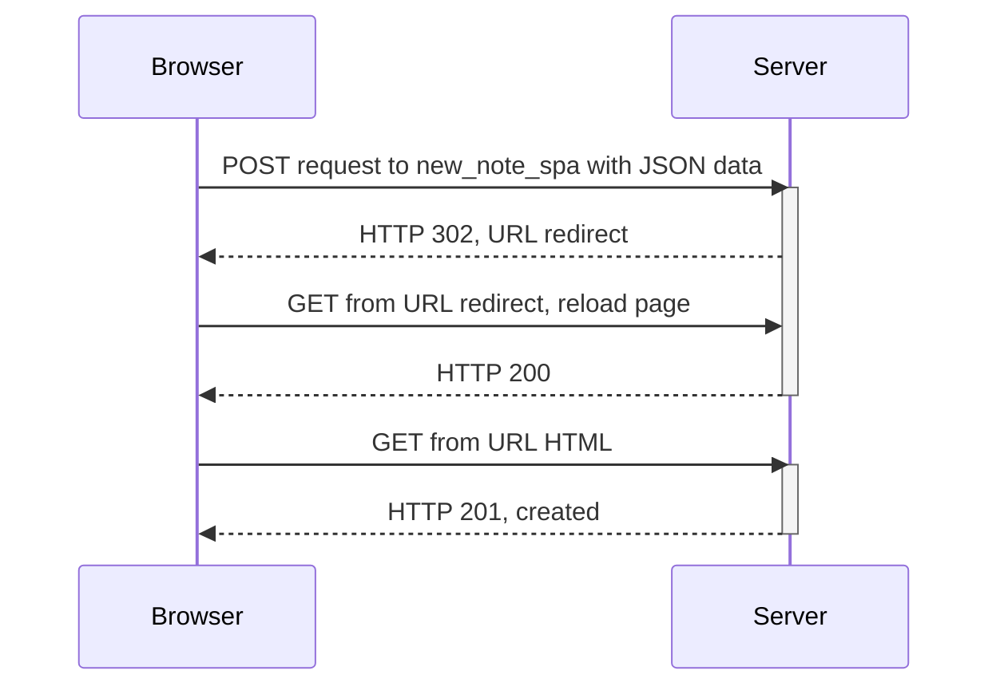

```mermaid
sequenceDiagram
participant Browser
participant Server

Browser->>Server: POST request to new_note_spa with JSON data
activate Server
Server-->>Browser: HTTP 302, URL redirect
Browser->>Server: GET from URL redirect, reload page
Server-->>Browser: HTTP 200
deactivate Server

Browser->>Server: GET from URL HTML
activate Server
Server-->>Browser: HTTP 201, created

deactivate Server
```
